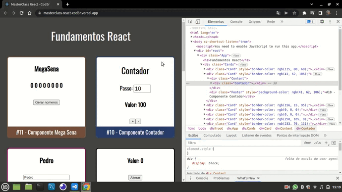

<p align="center">
   
</p>

<p align="center">
   
    
    
    
</p>

### Sobre o projeto

MasterClass do canal Cod3r onde foi realizado um projeto que abordou uma série de fundamentos da biblioteca Reactjs.


### Layout

O layout da aplicação da aplicação está disponível abaixo:

<div>
    <table>
      <thead>
        <tr>
           <th>
              
           </th>
        </tr>
      </thead>
      <tbody>
      </tbody>
    </table>
</div>

### 🚀 Como executar o projeto

Este projeto é dividido em três partes:

<ul>
   <li>Criação e desenvolvimento da estrutura principal do aplicativo React.</li>
   <li>Inserção e divisão de componentes da aplicação.</li>
   <li>Refatoração entre os componentes para melhor usabilidade.</li>
</ul>

#### Pré-requisitos

Antes de começar, você vai precisar ter instalado em sua máquina as seguintes ferramentas: [Git](https://git-scm.com/), [Node.js](https://nodejs.org/en/). Alem disto é bom ter um editor para trabalhar com o código como [VSCode](https://code.visualstudio.com/).

##### 🧭 Rodando a aplicação web - React

```bash

# Clone este repositório
$ git clone https://github.com/MateusMaciel340/masterclass-react-cod3r.git

# Acesse a pasta do projeto no terminal/cmd - React
$ cd masterclass-react-cod3r/

# Instale as dependências
$ npm install

# Você pode configurar isso em Scripts
$ npm start

```

💡 Projeto desenvolvido com React/JavaScript


### 🛠 Tecnologias

As seguintes ferramentas foram usadas na construção do projeto:

<b>Front-end ([React](https://pt-br.reactjs.org/))</b>

<ul>
   <li>React</li>
   <li>CSS</li>
   <li>CSS Puro - Estrutura</li>
</ul>

### 👨‍ Contribuidores

<div>
    <table>
      <thead>
        <tr>
           <th>
              
           </th>
        </tr>
      </thead>
      <tbody  align="center">
           <td>
             Mateus Maciel
           </td>
      </tbody>
    </table>
</div>

### 💪 Como contribuir para o projeto

1. Faça um **fork** do projeto.
2. Crie uma nova branch com as suas alterações: `git checkout -b feature/new-component`
3. Salve as alterações e crie uma mensagem de commit contando o que você fez: `git commit -m "Updated component new"`
4. Envie as suas alterações: `git push origin feature/new-component`

### 📝 Licença

Este projeto esta sobe a licença [MIT](https://github.com/nodejs/node/blob/master/LICENSE).